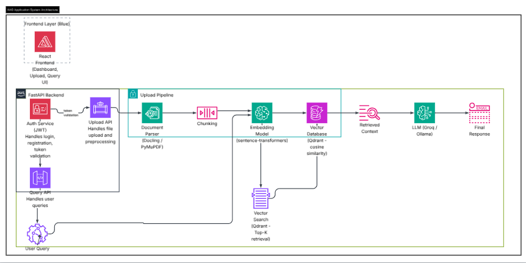

#   Infera

[Features](#-features) • [Demo](#-demo) • [Architecture](#-architecture) • [Quick Start](#-quick-start) • [Documentation](#-documentation) • [Contributing](#-contributing)

---

## Overview

**Infera** is an enterprise-grade AI-powered document intelligence platform that enables organizations to extract insights from their compliance documents instantly. Built with cutting-edge RAG (Retrieval-Augmented Generation) technology, it provides accurate, context-aware answers to queries across multiple document formats.

### Why Infera?

- 🎯 **Accuracy**: Leverages advanced RAG architecture with hybrid search for precise answers
- ⚡ **Speed**: Process and query documents in seconds, not hours
- 🔒 **Secure**: Enterprise-grade security with JWT authentication and encryption
- 📊 **Scalable**: Microservices architecture ready for enterprise deployment
- 🎨 **Beautiful UI**: Modern, intuitive interface built with React and Tailwind CSS
- 💼 **SaaS-Ready**: Multi-tenancy, subscription management, and usage tracking built-in

---

## Features

### 🔐 **Authentication & User Management**
- JWT-based secure authentication
- User registration and login
- Password hashing with bcrypt
- Role-based access control (RBAC)
- User profile management
- Session management

### 📄 **Multi-Format Document Processing**
- **Supported Formats**: PDF, DOCX, PPTX, TXT, Images (JPG, PNG), HTML, Markdown
- **Powered by Docling**: IBM's state-of-the-art document understanding library
- **OCR Capability**: Extract text from scanned documents and images
- **Structure Preservation**: Maintains tables, headings, and formatting
- **Batch Processing**: Upload multiple documents simultaneously

### 🧠 **Advanced RAG System**
- **Semantic Search**: Vector embeddings for contextual understanding
- **Hybrid Search**: Combines vector search with keyword matching
- **Intelligent Chunking**: Context-aware document segmentation
- **Source Citations**: Traceable answers with document references
- **Multi-Document QA**: Query across all uploaded documents
- **Conversation History**: Maintains context across queries

### 💬 **Intelligent Query Engine**
- Natural language question answering
- Follow-up question support
- Query enhancement and rewriting
- Confidence scoring
- Real-time streaming responses
- Multi-language support (via Groq/OpenAI)

### 🎨 **Modern User Interface**
- Clean, minimal design
- Responsive layout (mobile, tablet, desktop)
- Real-time upload progress
- Interactive chat interface
- Document viewer with highlighting
- Dark mode support (coming soon)

### 📊 **Document Management** (coming soon)
- Document library with search and filters
- Version control
- Tags and categories
- Document metadata tracking
- Delete and archive functionality
- Storage analytics

### 📈 **Analytics & Monitoring** (coming soon)
- Usage tracking per user
- Query analytics
- Document processing metrics
- System health monitoring
- Error logging and debugging

---

## Technology Stack

### **Backend**
- **Framework**: FastAPI (Python 3.12+)
- **Database**: SQLAlchemy with SQLite/PostgreSQL
- **Vector Database**: Qdrant (cloud-hosted)
- **Authentication**: JWT with python-jose
- **Document Processing**: Docling (IBM)
- **Embeddings**: Sentence Transformers (all-MiniLM-L6-v2)
- **LLM**: Groq (Llama 3.3 70B) / OpenAI GPT-4
- **API Documentation**: Swagger/OpenAPI

### **Frontend**
- **Framework**: React 18 with Vite
- **Styling**: Tailwind CSS
- **Icons**: Lucide React
- **HTTP Client**: Fetch API
- **State Management**: React Hooks (useState, useEffect)
- **Routing**: React Router (planned)

### **Infrastructure**
- **Containerization**: Docker + Docker Compose
- **CI/CD**: GitHub Actions (planned)
- **Cloud**: AWS / Railway / Vercel
- **Monitoring**: Sentry (planned)
- **Logging**: Structured logging

---

## 🏗️ System Architecture

The system is designed as a modular, production-oriented RAG pipeline:

### 🔹 Upload Pipeline
- Documents are uploaded via FastAPI
- Parsed using Docling / PyMuPDF
- Chunked and converted into embeddings using sentence-transformers
- Stored in Qdrant for efficient similarity search

### 🔹 Query Pipeline
- User queries are embedded into vector space
- Top-K relevant chunks are retrieved from Qdrant
- Context is passed to an LLM (Groq/Ollama) for response generation

### 🔹 Backend Layer
- FastAPI handles API orchestration
- JWT-based authentication ensures secure access

This architecture enables scalable, extensible, and production-ready RAG workflows.
